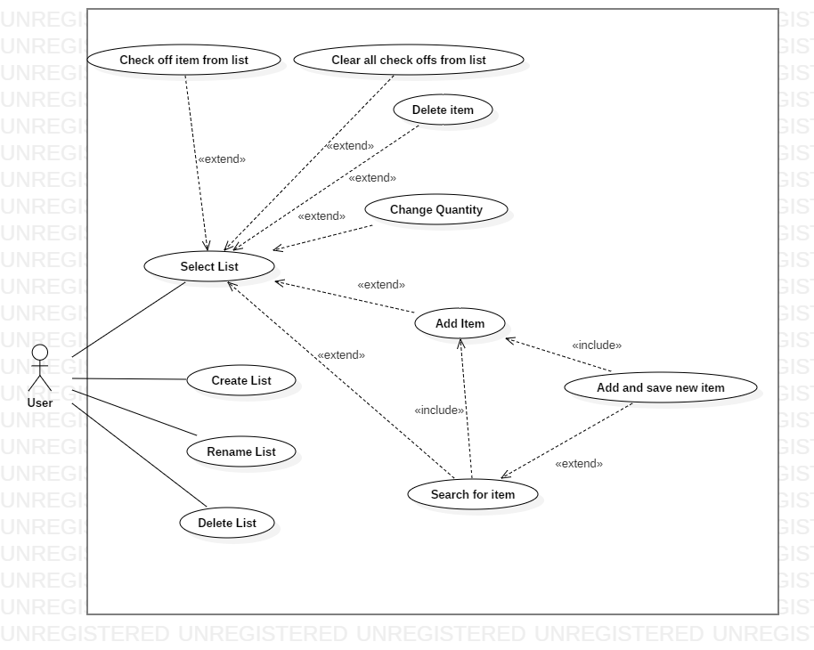

###Use Case Model

**Author**: Team 4

## 1 Use Case Diagram

## 2 Use Case Description

Select List

- Requirements: User can select a list to manage.
- Pre-conditions: User has at least one list.
- Post-conditions: User's GUI will show the selected list.
- Scenarios:
	1. User selects a list.

Create List

- Requirements: User has the choice of creating a new list.
- Pre-conditions: n/a
- Post-conditions: User has the option of using the newly created list. The newly created list will be saved.
- Scenarios:
	1. User selects option "Create New List".
	2. User enters a name for the list.
	3. User clicks "Create List".
	4. The system saves the list to the database.
- Alternative Scenarios:
	- 2a. User does not enter a name. The list is not created and a prompt appears to enter a name for the list.
- Exception:
	- 2a. User exits "Create List". The list is not created. The use case ends.

Rename List

- Requirements: User can rename a list that is stored.
- Pre-conditions: The list must already exist and should be found under "Select List".
- Post-conditions: The list will be renamed and saved.
- Scenarios:
	1. User chooses option "Rename List"
	2. The system opens a list of existing lists.
	3. User selects a list.
	4. User enters a name for the list.
	5. The system renames the list and saves the change.
- Alternative Scenarios:
	- 4a. User does not enter a name. The list's name is not changed and a prompt appears to enter a name for the list.
- Exception:
	- 2a. There are no existing lists. A warning appears saying there are no existing lists. The use case ends.
	- 3a. User exits "Rename List". The use case ends.

Delete List

- Requirements: User can delete an existing list.
- Pre-conditions: The list must already exist and be saved.
- Post-conditions: The list is removed from the database.
- Scenarios:
	1. User chooses option "Delete List"
	2. The system opens a list of existing lists.
	3. User selects a list.
	4. The system removes the selected list.
- Exception:
	- 2a. There are no existing lists. A warning appears saying there are no existing lists. The use case ends.
	- 3a. User exits "Delete List". The use case ends.

Check off item from list

- Requirements: User checks off an item on a list.
- Pre-conditions: The list must have been selected. The item must be on the list.
- Post-conditions: Item is checked off on the list.
- Scenarios:
	1. User checks off an item on the list.
	2. The system saves the check off for the item on the list.

Clear all check offs from list

- Requirements: User can clear all checks from a list(unchecked).
- Pre-conditions: The list is selected. The list has at least one item checked off.
- Post-conditions: The list has no checked off items.
- Scenarios:
	1. User chooses option "Clear all check offs from list".
	2. The system resets the checks for all items on the list.
- Alternative Scenarios:
	- 2a. There are no items on the list.
	- 2b. There are no checks on the list.

Delete item

- Requirements: User removes an item from a list.
- Pre-conditions: User has selected a list. The list has the selected item.
- Post-conditions: The list will no longer have the item.
- Scenarios:
	1. User chooses "Delete item" for an item on a list.
	2. The system removes the item from the list and saves the change.

Add item

- Requirements: User adds an item to the list.
- Pre-conditions: The item added was not previously there.
- Post-conditions: The item and quantity are added to the list.
- Scenarios:
	1. User chooses option "Add item".
	2. The system presents a list of items in the database by itemtype.
	3. User selects an item from the list to add.
	4. The system prompts the user for a quantity.
	5. User enters a valid quantity.
	6. The system saves the item and quantity to the list.
- Alternative Scenario:
	- 3a. The item already exists in the list. The system prompts the user to select a new item.
	- 5a. User enters an invalid quantity. The system prompts the user to enter a valid quantity.
- Exception:
	- 3b. User exits "Add Item". The use case ends.
	- 5b. User exits "Add Item". The selected item is not added to the list. The use case ends.

Change Quantity

- Requirements: User changes the quantity of a item on a list.
- Pre-conditions: User has selected a list. Item must exist in the list.
- Post-conditions: The list item will be updated with its quantity and saved.
- Scenarios:
	1. User selects "Change Quantity" for an item on the list.
	2. The system prompts the user for a quantity.
	3. User enters a valid quantity.
	4. The system changes the quantity for the list item and saves the change.
- Alternative Scenario:
	- 3a. User enters an invalid quantity. The system prompts the user to enter a valid quantity.
- Exception:
	- 3b. User exits "Change Quantity". The quantity is unchanged. The use case ends.

Search for Item

- Requirements: User searches for an item to add to list.
- Pre-conditions: Item does not exist in the current list.
- Post-conditions: A new item is added to the list with its quantity specified and saved.
- Scenarios:
	1. User chooses option "Search for item".
	2. User inputs a valid value to search.
	3. The system searches the existing database of items to match the search term and item names .
	4. The system presents a list of items with matching names. (Partial and full)
	5. User selects an item from the given list to add.
	6. See (Add Item).
- Alternative Scenario:
	- 2a. User enters an invalid term. The system prompts the user to enter a valid term.
	- 4a. The system does not find any matching items. The system prompts the user to add a new item to the database. See (Add and save new item).
	- 5a. User does not find the item in the given list. User selects to add a new item to the database. The system prompts the user to add a new item to the database. See (Add and save new item).
- Exception:
	- 2b. User exits "Search for Item". The use case ends.

Add and save new item

- Requirements: User adds an item with type and saves it to the database.
- Pre-conditions: User has selected a list. User searched for an item in the database to add. The system or the user did not find the item searched for.
- Post-conditions: The item is added to the database. The item with its quantity is added to the list and saved.
- Scenarios:
	1. The system prompts the user to add a new item to the database.
	2. User selects an existing item type and enters a valid item name.
	3. The system adds the item with its item type to the database.
	4. The system prompts the user to add the item to the list. (Add item)
	5. See (Add item) Steps 4-6.
- Alternative Scenarios:
	- 2a. User enters an invalid item name. The system prompts the user to enter a valid item name.
- Exception:
	- 2b. User exits "Add and save new item". The item is not added to the database and list. The use case ends.
	- 5a. User exits "Add and save new item". The item is added to the database. The item is not added to the list. The use case ends.
