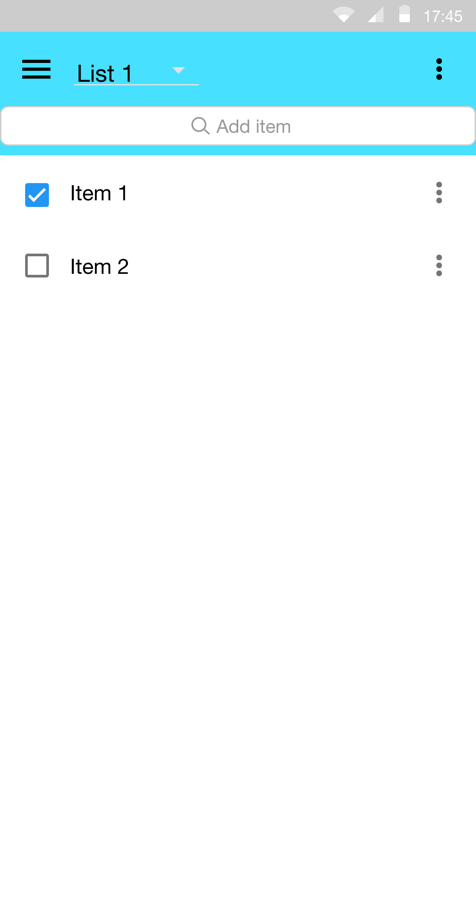

# Design Document

**Author**: Team 4

**Version**: 1.0

## 1 Design Considerations

### 1.1 Assumptions

Assume the user can download and install the apk file.

### 1.2 Constraints

Online grocery list sharing is not supported.

### 1.3 System Environment

Require Android 5.0 or above and has at least 50MB storage free.

## 2 Architectural Design

*The architecture provides the high-level design view of a system and provides a basis for more detailed design work. These subsections describe the top-level components of the system you are building and their relationships.*

### 2.1 Component Diagram

- ListManager component required an interface provided by GroceryList component.
- Item component provides an interface for GroceryList component to select items.
- ItemType component provided interface for GroceryList component so it can perform an operation to search for items and ItemType component require interface provided by Item component.
- The database provide interface for Item component.

### 2.2 Deployment Diagram

*This section should describe how the different components will be deployed on actual hardware devices. Similar to the previous subsection, this diagram may be unnecessary for simple systems; in these cases, simply state so and concisely state why.*

## 3 Low-Level Design

*Describe the low-level design for each of the system components identified in the previous section. For each component, you should provide details in the following UML diagrams to show its internal structure.*

### 3.1 Class Diagram

*In the case of an OO design, the internal structure of a software component would typically be expressed as a UML class diagram that represents the static class structure for the component and their relationships.*

### 3.2 Other Diagrams

*<u>Optionally</u>, you can decide to describe some dynamic aspects of your system using one or more behavioral diagrams, such as sequence and state diagrams.*

## 4 User Interface Design

When the app launch, it show the last grocery list selected and items in that list.

Can select different grocery list by clicking the list's name on the top

To Add an item, type in the item's name into the search box

Can search item by type, clear all checked item, check all item, delete checked item, or delete all item by clinking  on the top right corner

Edit each item quantity by clicking  to the right on that item

When search by type is clicked, list of types will be show then list of items of selected type will be shows.

You can also search the type or item by typing the type or item name in the search box

When the menu icon  is clicked, a menu show up and can navigate to List management or add a new item

In List management, you can add a new list, edit list's name, delete checked list, delete all list.

In Add new Item.

