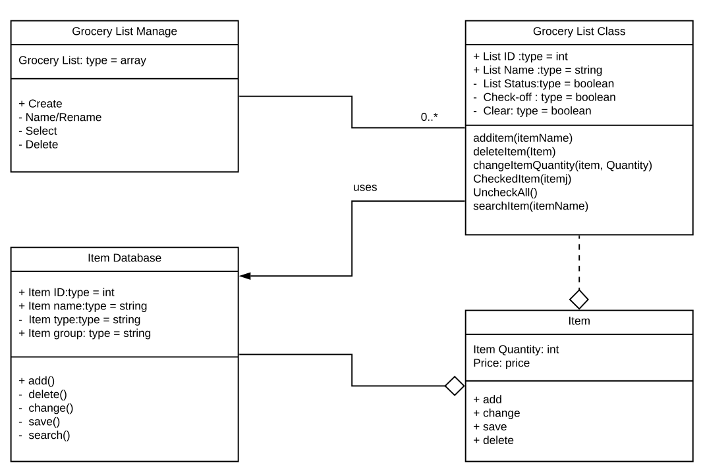
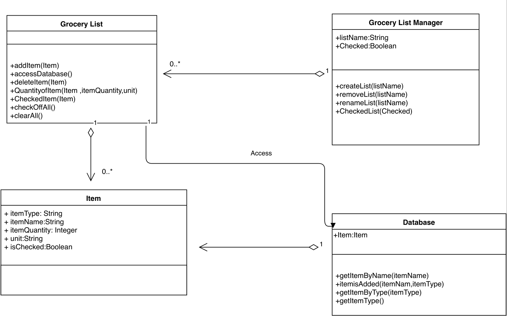

### Individual Designs

#### Design 1
---

Pro:
1. Clean diagram
2. Easy to view classes

Con:
1. Missing the type of visibility for some operations and attribute
2. Database class is not necessary 
3. Missing return type
4. Missing item types to reference for Item

#### Design 2
---

Pro:
1. The type and visibility of attributes and operations are all specified

Con:
1. Attributes of addToList could be attributes of the Item class
2. Unclear relationships between classes

#### Design 3
---

Pro:
1. Good class naming
2. Easy to identify all the classes

Con:
1.Bad diagram style
2.Database class is not necessary 
3.Missing return type for operations

#### Design 4
---

Design#4:
Pro:
1. Meets all the requirements of the design   

Con:
1. Missing some operation return type
2. Item quantity should be double 
3. Missing unit

#### Design 5

Team member did not submit

### Team Design
---

Design#1:
Commonalities:
1. Similar grocery list,grocery list manager, and item class.

Differences:
1. Missing unit      
2. Database class is not necessary
3. Missing Item Type class

Design#2:
Commonalities:
1. Similar grocery list,grocery list manager, and item class.
2. Some operations and attributes are similar
3. Similar way to represent classes

Differences:
1. Missing unit
2. addToList attributes placed in Item

Design#3:
Commonalities:
1. Some classes have the similar attribute and operations.

Differences:
1. Some relationships are different.
2. Database is not necessary
3. More details added to classes
      
Design#4:
Commonalities:
1. Class names.
2. Relations between classes.
3. Attribute names and operation names.

Differences: 
1. Missing unit
2. Operation return type
3. Quantity as a double

### Summary
---
1. Different group members can bring different perspectives to the design.
2. Ideas can be clarified in discussing the design
3. Each group member found mistakes on their design after the discussing.
4. Focus on more details for each part of the design.
5. All attributes and operations should be well typed, thus making relationships between classes clear.
