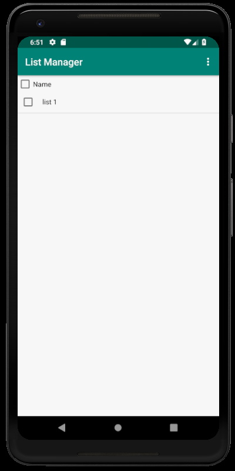
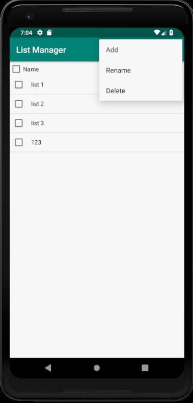
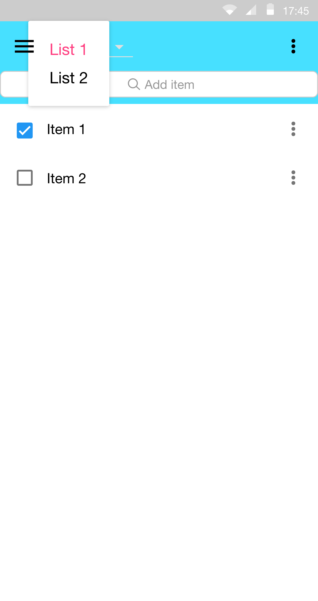
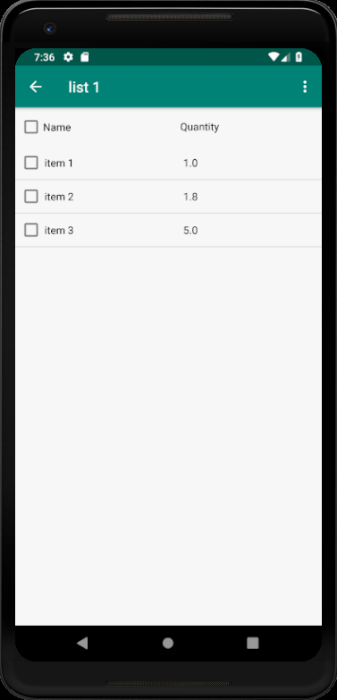
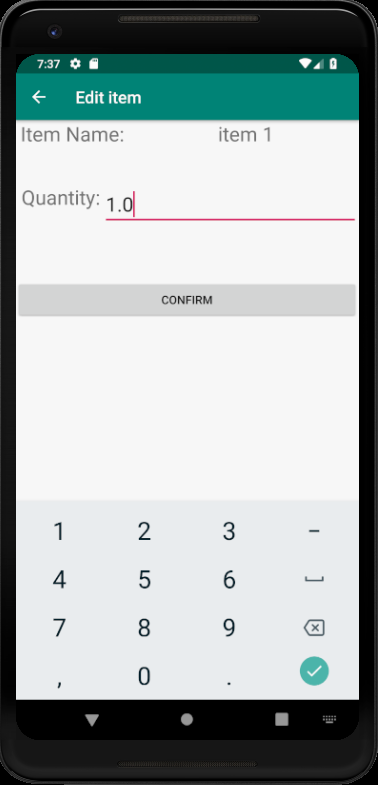
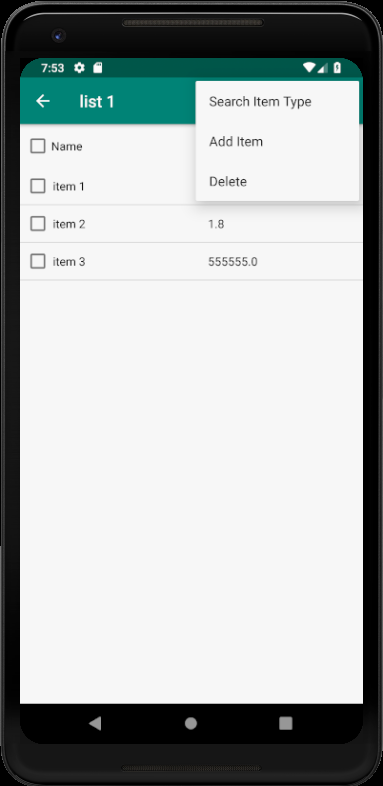
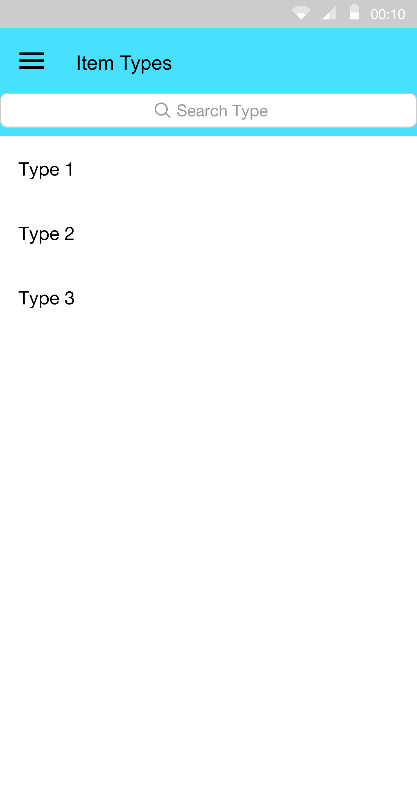
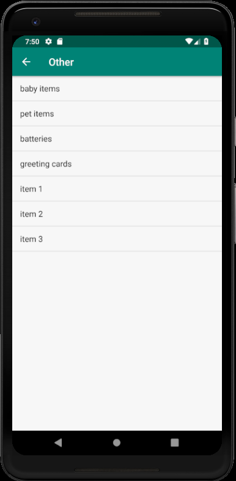
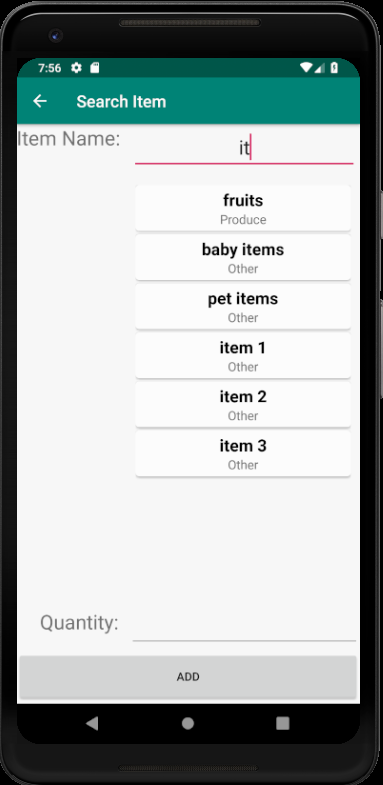
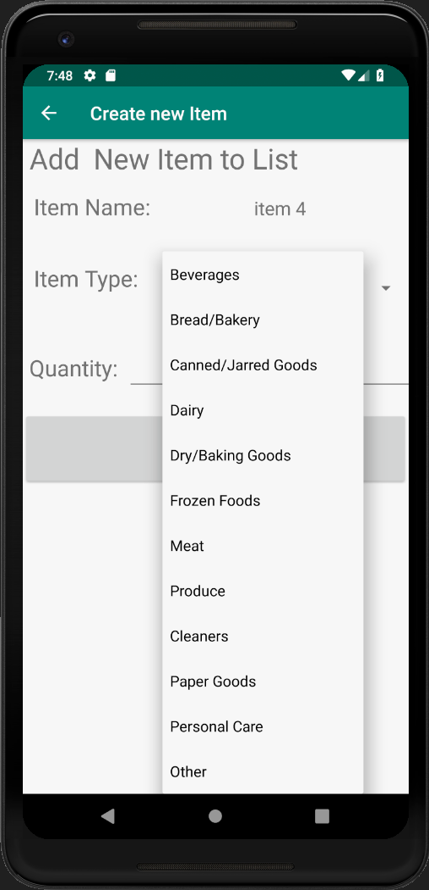

# Design Document

**Author**: Team 4

**Version**: 1.0

## 1 Design Considerations

### 1.1 Assumptions

Assume the user can download and install the apk file.

### 1.2 Constraints

Online grocery list sharing is not supported.

### 1.3 System Environment

Require Android 5.0 or above and has at least 50MB storage free.

## 2 Architectural Design

*The architecture provides the high-level design view of a system and provides a basis for more detailed design work. These subsections describe the top-level components of the system you are building and their relationships.*

### 2.1 Component Diagram

- ListManager component required an interface provided by GroceryList component.
- Item component provides an interface for GroceryList component to select items.
- ItemType component provided interface for GroceryList component so it can perform an operation to search for items and ItemType component require interface provided by Item component.
- The database provide interface for Item component.

### 2.2 Deployment Diagram

- The deployment diagram is simple and straight forward, since the only hardware element is android device, which everything is run on the device and handle its own database.

## 3 Low-Level Design

*Describe the low-level design for each of the system components identified in the previous section. For each component, you should provide details in the following UML diagrams to show its internal structure.*

### 3.1 Class Diagram

*In the case of an OO design, the internal structure of a software component would typically be expressed as a UML class diagram that represents the static class structure for the component and their relationships.*

### 3.2 Other Diagrams

- In the sequence diagram, describe the interactions between List Manager, Grocery List, Item and ItemType.

## 4 User Interface Design

When the app launch, it show all grocery list.

Can add, rename, or delete list by clicking top right 

Can select different grocery list by clicking the list's name.

Inside a grocery list show list of items in that list

Edit each item quantity by clicking on the item

Can Search item by type, add item by search item name, and delete selected item by clicking 

When search by type is clicked, list of types will be show then list of items of selected type will be shows.

When searching item name, result will shows

Create a new item and add to list

